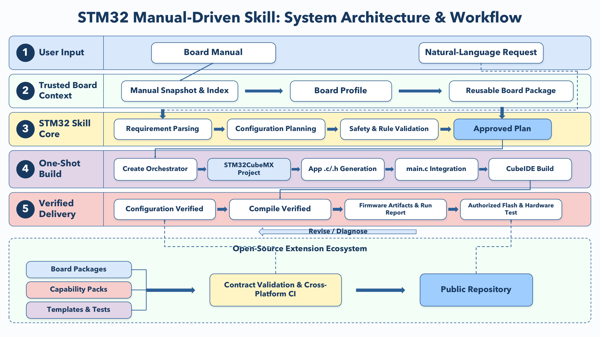
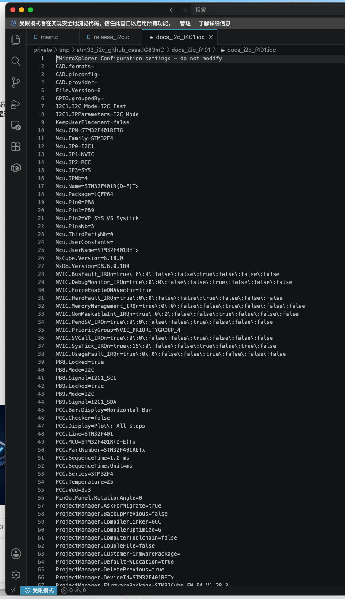
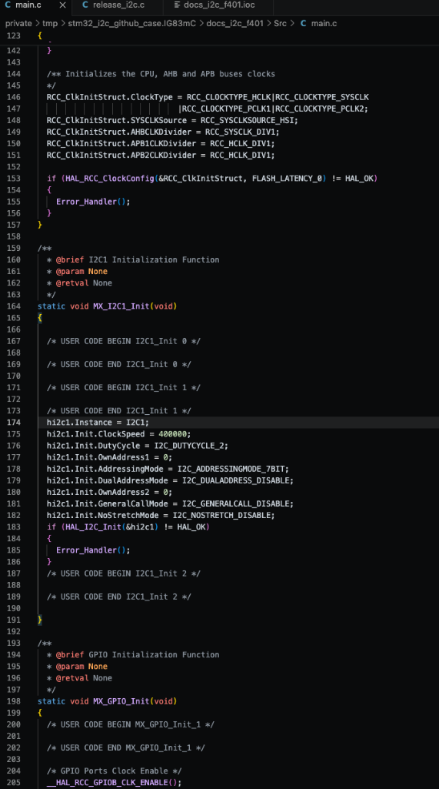
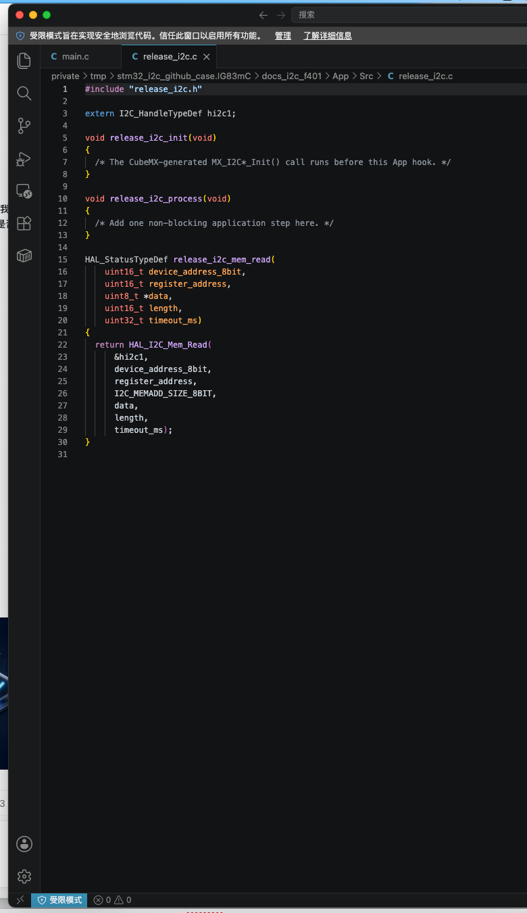
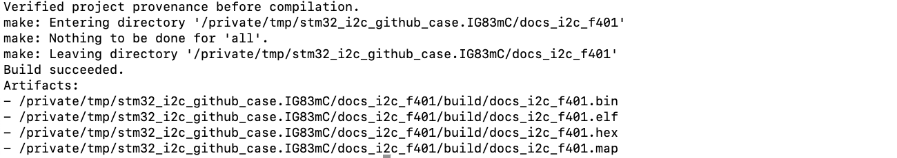

# STM32 Manual-Driven Codex Skill

Turn an STM32 board manual and a natural-language request into a verified
CubeMX project, reusable App modules, and compiled firmware artifacts.

`stm32-cubemx-build` is a Codex Skill for GPIO, UART, I2C, SPI, PWM, timers,
servos, and application modules. It grounds configuration in page-cited board
facts, generates a fresh CubeMX Makefile project, integrates App `.c/.h` files
into `main.c`, and builds with CubeIDE's Arm toolchain on macOS or Windows.
VS Code is optional.

Board packages, capability packs, templates, and tests form an open extension
layer so contributors can add hardware support and reusable functions without
changing the core workflow.

## Architecture and workflow

<p align="center">
  <a href="docs/assets/stm32-skill-architecture-workflow.png">
    
  </a>
</p>

## What the Skill produces

- a page-cited `board-profile.json` for the MCU, board pins, clocks, and
  board constraints used by the request;
- a `configuration-plan.json` that maps the request to local CubeMX settings;
- a fresh CubeMX Makefile project with `.ioc`, HAL/CMSIS source, and build
  files;
- pack-backed or generic App modules in `App/Inc` and `App/Src`;
- integration calls in CubeMX `USER CODE` regions; and
- a compilation result with the generated artifacts reported by the toolchain.

## Included packs

| Pack | Purpose | Generated App API |
| --- | --- | --- |
| `gpio` | Push-pull digital output | Write and toggle a documented pin |
| `gpio_input` | Polled or EXTI digital input | Debounce, press, release, and long-press events |
| `uart` | Asynchronous serial port | Send and receive with an explicit timeout |
| `i2c` | I2C bus | Read device registers through an HAL handle |
| `spi` | 8-bit full-duplex master bus | Transfer buffers through an HAL handle |
| `pwm` | Timer PWM output | Set duty cycle for a selected channel |
| `servo` | 50 Hz hobby-servo output | Set pulse width or 0–180 degree angle |
| `timer` | Periodic timer dispatch | Consume timer ticks from the main loop |

## Community board catalog

The installable Skill includes a validated catalog under
`stm32-cubemx-build/boards/`. Contributors can add one page-cited board package
through a pull request so later users can reuse its MCU, clock, connector, pin,
and electrical facts.

```bash
python stm32-cubemx-build/scripts/list_boards.py
python stm32-cubemx-build/scripts/validate_boards.py
```

Each package links to an official manual and records its SHA-256; vendor PDFs
and extracted full-text indexes stay outside the repository. A user still
supplies the exact manual locally before the profile can drive generation.
See [CONTRIBUTING.md](CONTRIBUTING.md) for the package layout and review rules.

## See it work: a real I2C run

This example records a local CubeMX generation-and-compilation run on macOS
using a synthetic STM32F401 I2C manual fixture.

**Scenario:** configure `I2C1` at **400 kHz** on documented `PB8` /
`PB9`, generate the `release_i2c` App module, integrate it only into
CubeMX `USER CODE` regions, then compile.

All four images below are authentic local software captures, cropped only to
remove unrelated desktop content.

### 1. CubeMX-generated configuration evidence

<p align="center">
  <a href="docs/assets/i2c-case-cubemx-ioc.png">
    
  </a>
</p>

The `.ioc` file generated by CubeMX records `I2C1.I2C_Mode=I2C_Fast`,
`PB8.Signal=I2C1_SCL`, and `PB9.Signal=I2C1_SDA`. It is shown here in
VS Code so the exact generated facts remain readable in the repository.

### 2. Generated initialization and App module

<p align="center">
  <a href="docs/assets/i2c-case-main-init.png">
    
  </a>
  <a href="docs/assets/i2c-case-module.png">
    
  </a>
</p>

The generated `main.c` sets `hi2c1.Init.ClockSpeed = 400000`. The generated
`App/Src/release_i2c.c` then exposes an App boundary and a
`HAL_I2C_Mem_Read` wrapper with an explicit timeout using the verified
`hi2c1` handle.

### 3. Compile-only result

<p align="center">
  <a href="docs/assets/i2c-case-build.png">
    
  </a>
</p>

The local build verified project provenance first, then produced `.elf`,
`.bin`, `.hex`, and `.map` artifacts. Its recorded result level is
**Compile verified**.

## Workflow

1. Upload the board manual and describe the firmware task.
2. Reuse a matching validated community board package or build a board profile
   from page-cited manual facts. Each fact records a concise anchor from the
   cited page.
3. Select the required packs and create a configuration plan from the board
   profile and the installed CubeMX MCU database.
4. Generate the new project and verify the requested pins, parameters, and
   source assertions in CubeMX output.
5. Run `create` once to generate the project, render every planned App module,
   integrate `main.c`, compile, and write `codex-run-report.json` with stage timings.

```bash
python stm32-cubemx-build/scripts/stm32_cube.py create \
  --mcu STM32F103ZETx \
  --name servo_demo \
  --output-dir /absolute/output \
  --board-profile /absolute/input/board-profile.json \
  --manual /absolute/input/board-manual.pdf \
  --manual-index /absolute/input/board.manual-index.json \
  --plan /absolute/input/configuration-plan.json
```

The local PDF index contains extracted manual pages. Reuse it with
`--manual-index` on later runs of the same manual; its manual SHA-256 binding
prevents reuse with different PDF bytes.

CubeMX runs have a 180-second default timeout. A pending firmware-license or
package dialog is reported directly instead of leaving the workflow open for
an unbounded period.

Each plan uses a new output directory. Existing projects stay in place, while
generated project code comes from CubeMX and application code lives in `App/`
and CubeMX user-code regions.

## Install in Codex

Copy the inner `stm32-cubemx-build` directory into your Codex skills folder:

- macOS: `~/.codex/skills/stm32-cubemx-build`
- Windows: `%USERPROFILE%\.codex\skills\stm32-cubemx-build`

On Windows, the Skill runs inside the Codex desktop app. VS Code is optional
for viewing the generated project and source files.

Then upload a board manual and ask, for example:

> Use `$stm32-cubemx-build` to read this board manual and create a 400 kHz I2C
> temperature-sensor project. Use documented available pins, create a
> `sensor_service` App module, and compile it.

## Prerequisites

1. STM32CubeMX 6.x.
2. STM32CubeIDE, which supplies the Arm GCC and Make tools.
3. Python 3 and `pypdf`:

   ```bash
   python -m pip install -r stm32-cubemx-build/requirements.txt
   ```

4. The STM32Cube firmware package for the selected MCU family.

Check the environment with:

```bash
python stm32-cubemx-build/scripts/stm32_cube.py doctor --strict
```

On Windows, provide custom application locations as leading options:

~~~powershell
python stm32-cubemx-build/scripts/stm32_cube.py --cubemx "C:\path\to\STM32CubeMX.exe" --cubeide "C:\path\to\stm32cubeide.exe" doctor --strict
~~~

Use the same `--cubemx` and `--cubeide` options with `create`, `revise`, and `build`.

## Windows end-to-end check

`scripts/windows_smoke.ps1` runs the complete local workflow from a manual,
board profile, and configuration plan through the one-shot `create` command.

~~~powershell
$skill = "$env:USERPROFILE\.codex\skills\stm32-cubemx-build\scripts\windows_smoke.ps1"
& $skill -Manual "C:\work\board-manual.pdf" -ManualIndex "C:\work\board.manual-index.json" -BoardProfile "C:\work\board-profile.json" -Plan "C:\work\configuration-plan.json" -Mcu "STM32F103ZETx" -OutputDir "C:\work\stm32-output" -ProjectName "servo_test"
~~~

`WINDOWS_SMOKE_PASS` reports a complete generation-and-compilation run. Flash,
debug, and on-board measurements belong to a separate hardware run.

Use [docs/windows-acceptance.md](docs/windows-acceptance.md) for the complete
deployment and acceptance checklist.

## Result vocabulary

The Skill reports results at the level it has completed:

- **Configuration verified**: CubeMX output matches the plan's requested pins,
  parameters, and assertions.
- **Compile verified**: CubeIDE's toolchain builds the generated source.
- **Flash verified**: the artifact hash was explicitly authorized, the target
  ID and voltage matched, pre-flash bytes were backed up, and programming was verified.
- **Hardware run**: the flashed board has been exercised against on-board acceptance criteria.

## Validation in this release

- 100 deterministic tests cover profile validation, community board packages,
  configuration planning, generation provenance, pack rendering, integration,
  and build preparation.
- All eight built-in pack contracts validate.
- The current source completed an I2C flow with CubeMX generation, App module
  integration, and compilation to `.elf`, `.bin`, and `.hex` artifacts.

See [VALIDATION.md](VALIDATION.md) for the concise validation record and
[CONTRIBUTING.md](CONTRIBUTING.md) for the community pack model.

## Development check

From the repository root:

```bash
python -m unittest discover -s tests -v
python stm32-cubemx-build/scripts/validate_packs.py
python stm32-cubemx-build/scripts/validate_boards.py
python stm32-cubemx-build/scripts/stm32_cube.py doctor --strict
```

GitHub Actions runs the deterministic tests, capability-pack validation,
community-board validation, and Python compile check on Linux, macOS, and
Windows. The Windows runner also executes the complete PowerShell smoke
orchestration from environment check through artifact production with
deterministic tool fixtures.

The complete operating workflow is in
[`stm32-cubemx-build/SKILL.md`](stm32-cubemx-build/SKILL.md). The detailed data
contracts live in `stm32-cubemx-build/references/`.

## License

Apache-2.0. See [LICENSE](LICENSE).
